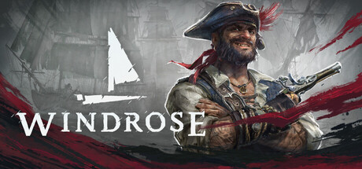

# 게임 QA 포트폴리오 - Windrose

#### 'Windrose' 라이브 빌드를 기반으로 수행한 QA 프로젝트 공간입니다. 
#### 본 페이지에서는 QA 포트폴리오 원본(PDF)과 세부 QA 내용이 포함된 레포트(PDF)를 제공합니다. 
#### QA 포트폴리오는 현재 작성 중에 있습니다.
---
## 1. 게임 소개

| 구분 | 내용 |
| :--- | :--- |
| 게임 이름 | Windrose |
| 개발 | Kraken Express |
| 장르 | 오픈월드, 생존 어드벤처, RPG |
| 엔진 | 언리얼 엔진 5 |

 

## 2. 게임 구조
| 주요 플레이 루프 |
| :---: |
| **탐사 및 생존** &nbsp;&rarr;&nbsp; **선박 건조 및 탐험** &nbsp;&rarr;&nbsp; **전투 및 보스 공략** |

### 1) 탐사 및 생존
섬과 해역을 탐험하며 자원을 채집하고, 거점 및 기지를 건설해 생존 기반을 구축합니다.

### 2) 선박 건조 및 탐험
확보한 자원을 바탕으로 여러 장비을 업그레이드하고 선박을 건조한 후 새로운 지역을 탐험합니다.

### 3) 전투 및 보스 공략
보스를 격퇴하고 다양한 전투를 통해 보다 새로운 지역과 보상에 도전합니다.

 

## 3. QA 결과 요약
| 총 결함 수 | 7 |
| :--- | :--- |
| Highest (매우 높음) | 1 - 더미 데이터의 잔존 결함 등 |
| High (높음) | 4 - 밸런스 결함, UI/UX의 기능 부재 결함 등 |
| Medium (보통) | 2 - AI의 전투 메커니즘 결함, UI/UX 편의성 결함 등 |

Windrose - 0.10.0.6 버전는 현재 밸런스 결함, 기능 부재 등 보다 기본적인 문제에 직면하고 있습니다.. 
현재 정식 출시에 앞서 전투 메커니즘 개선, UI/UX의 기능 추가 등 전반적인 구조 개선이 필요합니다.

 

<b>레포트 요약(클릭하여 펼치기)</b>

#### 게임 버전 0.10.0.6 | 레포트 v1.0 │ [원본 문서 보기](./QA_Windrose_Report_Ver_01.pdf)

| 워크 플로우 | 업무 영역 | 우선 순위 | 내용 요약 |
| :--- | :--- | :---: | :--- |
| 구조화 및 분석 | **밸런스 (BAL)** | High | 양손 무기, 강공격의 스테미나 소모 리스크 대비 메리트 저하로 인한 전략성 무효화 |
| 구조화 및 분석 | **밸런스 (BAL)** | Medium | 적대 개체의 단조로운 공격 메커니즘 |
| 구조화 및 분석 | **기능 (SYS)** | High | 아이템 폐기 기능 부재로 인한 인벤토리 및 보관함 정리 불가 |
| 결함 발견 및 등록 | **기능 (SYS)** | Highest | 바다 위에서 사망 시 회수 가능한 자원이 없어도 표식이 남아있는 결함 |
| 구조화 및 분석 | **UI/UX (UI/UX)** | Medium | NPC 거래 UI 내 수량 선택 편의성 기능 부재 |
| 구조화 및 분석 | **밸런스 (BAL)** | High | 중간 티어 선박의 스펙 저하로 인한 콘텐츠 스킵 현상 |
| 라이브 패치 모니터링 | **성능 및 최적화 (PERF)** | High | 에셋이 개별 오브젝트 구성 및 소멸 지연으로 인한 프레임 드랍 |

